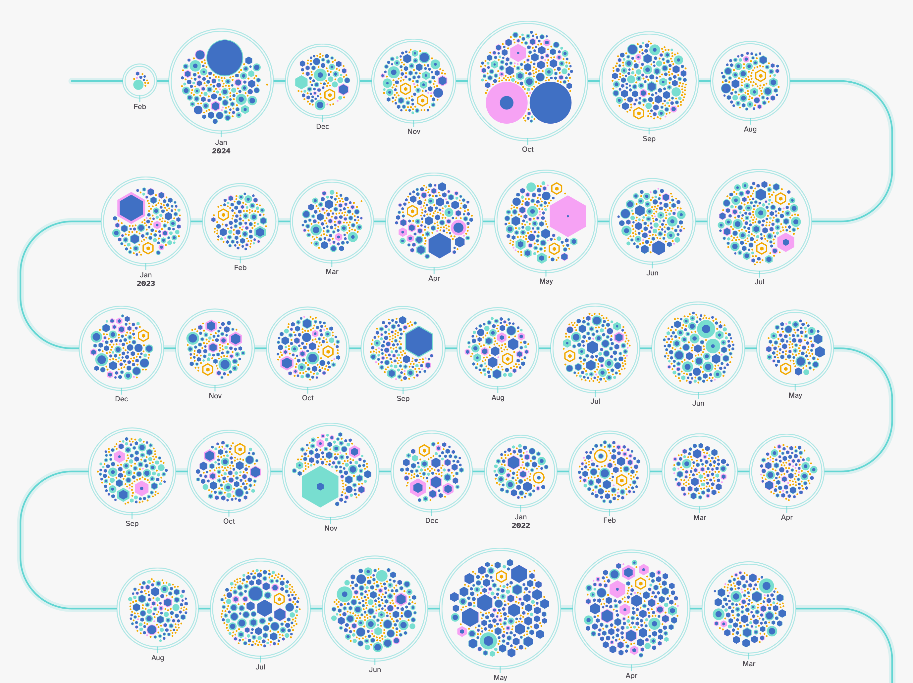

# Git Commit History Visual

This visualization **shows the commit history of a specific GitHub repository**. It groups all of the commits by month and reveals each commit as a small circle/hexagon, scaled to the number of lines changed in the commit.

The visualization is **interactive** and allows the user to hover and click any of the commits to see more information about the commit and to highlight all the other commits made by the same author.



## Setting up the chart

**The visual** depends heavily on [**d3.js**](https://github.com/d3/d3). It also uses [**seedRandom**](https://www.npmjs.com/package/seedrandom) to make sure the visual always gives the same output with the same initial settings.

[**awesomplete**](https://projects.verou.me/awesomplete/) is used for the search box at the bottom of the visual in the example showcase of `mozilla/pdf.js`. However, this is not an integral part of the visual code and can be left out.

Finally, there is the custom **createORCAVisual.js** file that needs to be included.

```html
<!-- JavaScript libraries -->
<script src="lib/d3.v7.js"></script>
<script src="lib/seedRandom.min.js"></script>
<!-- not required -->
<script src="lib/awesomplete.min.js"></script>

<!-- Custom JavaScript file -->
<script src="createORCAVisual.js"></script>

<!-- Custom CSS -->
<!-- required, but you can adjust the colors if you wish -->
<link rel="stylesheet" href="css/chart.css">
<!-- not required, mainly used to style the showcase example page -->
<link rel="stylesheet" href="css/style.css">
<!-- not required, only used to style (parts of) the search box -->
<link rel="stylesheet" href="css/awesomplete.css"> 
```

As you can see at the end, there are also several `css` files loaded. Only the first one is required for the visual and its interactions to function properly. The other two are used to style the showcase example page and the search box at the bottom of the visual.

In the body, you will need the following HTML structure:

```html
<!-- Loading & Interaction message -->
<!-- This should be placed right above the container that holds the visual -->
<div id="loading">
    <p id="loading-message">Crunching all the commits...</p>
</div>

<!-- The visual will be drawn here -->
<div id="chart-container">

    <!-- The Tooltip needs to be placed within the container that holds the visual -->
    <div id="tooltip">
        <div class="tooltip-container">
            <span id="tooltip-close">&times;</span>
            <p class="tooltip-header">author</p>
            <p id="tooltip-author-name">Name</p>
            <p class="tooltip-header">committed on</p>
            <p id="tooltip-commit-time">February 7, 2024</p>
            <p id="tooltip-commit-title"></p>
            <p id="tooltip-commit-release-header" class="tooltip-header">release</p>
            <p id="tooltip-commit-release">v4.7.09</p>
            <p class="tooltip-header">changes made</p>
            <p id="tooltip-files-changed" class="tooltip-changes"><span id="tooltip-num-files">3 files</span> changed</p>
            <p id="tooltip-commit-changes" class="tooltip-changes"><span id="tooltip-num-insertions">468 insertions</span> <span class="insertions">(+)</span> / <span id="tooltip-num-deletions">263 deletions</span> <span class="deletions">(-)</span></p>
            <p class="tooltip-header">commit hash</p>
            <p id="tooltip-commit-hash"></p>
        </div>
    </div>

</div>
```

Next, set up some initial settings for the visual. The `REPOSITORY_FULL` variable should be set to the full name of the repository, including the _owner_ (and `/` in between), such as `mozilla/pdf.js`. The `container` variable should be set to the div container that will hold the chart. The `width` variable should be set to the width of the container.

```js
const REPOSITORY_FULL = "mozilla/pdf.js" // The name of the central repository

// Get the div container that will hold the chart
const container = document.getElementById("chart-container")
// Get the width of the container
let width = container.offsetWidth
```

Next, you read the datasets and supply them to the `createORCAVisual` function. The specifics of the datasets are explained further below.

```js
////////////////// Datasets to Read in //////////////////
// A dataset about the commit history and the ORCA recipients (the latter is optional)
// in that order

let promises = []
promises.push(d3.csv(`data/pdfjs/commits.csv`))
promises.push(d3.csv(`data/pdfjs/orca_recipients.csv`)) // optional

///////////////////// Start Drawing /////////////////////
createORCAVisual(container).then(ORCAVisual => {
    // Set-up the visual with a specific width - Doesn't draw anything yet
    ORCAVisual.width(width)

    Promise.all(promises).then(values => {
        // Create the visual after supplying the data (values)
        ORCAVisual(values)
    })//promises
})//createORCAVisual
```

See the `index.html` file for a more complete example of how to set up the visual.

## Data

<a href="#commits" name="commits">#</a> <b>commits.csv</b> _[required]_

The _commits.csv_ dataset contains the information about each _commit_ of the repository. You can gather the information required for this dataset by using the `git log` functionality in your terminal. The following command will give you the information required for each commit (you need to be in the repository's folder to run this).:

```bash
( echo "commit_hash", "decorations","committer_email", "committer_name", "commit_time", "author_email", "author_name", "author_time", "commit_title"; git log --pretty='format:commit, %H, ^%D^, %ce, ^%cN^, %ci, %ae, ^%aN^, %ai, ^%s^' --shortstat --tags -M20 -C20 origin/master ) > log.txt
```

_Why the weird `^` around some of the fields? Honestly, because it was the only way I could get the textual fields, such as the commit title, to be read properly in R. Otherwise some of the rows would split up into new columns due to the usage of a variety of `", ', ``, #` and other marks. I therefore used the `^` to act as a `quote`._

You can find more information about what kind of git log options you have in the [pretty-formats](https://git-scm.com/docs/pretty-formats) and [git log](https://git-scm.com/docs/git-log) documentation.

It's this dataset that contains all of the information that is used in this visual and its almost perfect to use as-is. However, the number of files changed, line insertions and line deletions are added as a separate row each time. Something such as `2 files changed, 13 insertions(+), 26 deletions(-)`. Therefore, to get this final bit in a `csv` ready format, you have to do some final data preparation to the `txt` file to add the `files_changed`, `line_insertions` and `line_deletions` to each row.

This dataset has the following fields:

* **commit_hash** | `%H` | The commit hash.
* **decorations** | `%D` | Ref names, used to find version releases.
* **committer_email** | `%ce` | _[optional]_ | The committer email.
* **committer_name** | `%cN` | _[optional]_ | The committer name.
* **commit_time** | `%ci` | The commit date, in the following format `"2014-02-21 15:46:55 +0100"`.
* **author_email** | `%ae` | The author email.
* **author_name** | `%aN` | The author name.
* **author_time** | `%ai` | _[optional]_ | The author (commit) date, in the following format `"2014-02-21 15:46:55 +0100"`.
* **author_name** | `%s` | The subject of the commit.
* **files_changed** | The number of files changed.
* **line_insertions** | The number of lines inserted.
* **line_deletions** | The number of lines deleted.

The final three fields are not yet in a `csv` ready format in the `log.txt` file that is created by the `git log` command. These have to be added through some final data preparation.

<a href="#orca_recipients" name="orca_recipients">#</a> <b>orca_recipients.csv</b> _[optional]_

The _orca_recipients.csv_ dataset contains information about those contributors who received ORCA for making noteworthy contributions to the repository.

This dataset requires the following fields:

* **name** | The name of the ORCA recipient - should match the author name of the commits.
* **email** | The email of the ORCA recipient.
* **contribution** | _[optional]_ | A short description of the contribution of the ORCA recipient to the repository.

This information is used to turn some of the commit circles into hexagons, by **matching the name and/or email to the author name and email of the commits**. It also adds some extra information about ORCA in the introduction and below the visual.

This dataset is optional and can be left out if you don't have this information or no ORCA was given to the contributors of the repository. Simply remove the `promises.push(d3.csv("data/pdfjs/orca_recipients.csv"))` line.

## API Reference

<a href="#ORCAVisual" name="ORCAVisual">#</a> <b>createORCAVisual</b>([_container_])

Constructs the basics of the eventual visualization with the default settings. Will still require the datasets and a [_width_](#width) to be set.

<a href="#width" name="width">#</a> <i>createORCAVisual</i>.<b>width</b>([<i>width</i>])

Set or reset the _width_ of the chart. This should be a number. The default value is 1500px.

```js
ORCAVisual.width(1800)
```

Apart from setting the _width_ the very first time as you create the visual function, any new call to `.width()` should be accompanied by a call to [_resize_](#resize) to actually make the visual take on its new width.

<a href="#resize" name="resize">#</a> <i>createORCAVisual</i>.<b>resize</b>()

Call this function whenever you want to resize the "canvas" of the chart, the area in which the chart is visible. You give a new [_width_](#width) and next call _resize_. See below for a simple resizing example, and the _index.html_ for a slightly better example.

```js
let current_width = window.innerWidth
window.addEventListener("resize", function () {
    if(window.innerWidth !== current_width) {
        current_width = window.innerWidth
        //Decide what new sizes should be
        // .....
        // width = ....
        //
        ORCAVisual
            .width(width)
            .resize()
    }//if
})//on resize
```

<a href="#highlight" name="highlight">#</a> <i>createORCAVisual</i>.<b>highlight</b>([<i>name</i>])

Calling this function will highlight and fix all the commits made by the author with the given name as if a `click` event happened. This should be a string.

```js
ORCAVisual.highlight(name)
```

<a href="#reset" name="reset">#</a> <i>createORCAVisual</i>.<b>reset</b>()

Calling this function will reset the visual to its original state, removing any highlights. This is generally used in conjunction with the [_highlight_](#highlight) functionality. It doesn't take any arguments.

```js
ORCAVisual.reset()
```
